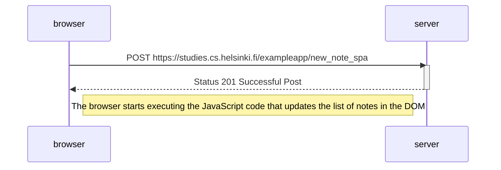

```mermaid
sequenceDiagram
    participant browser
    participant server

    browser->>server: POST https://studies.cs.helsinki.fi/exampleapp/new_note_spa
    
    activate server
    server-->>browser: Status 201 Successful Post
    deactivate server

    Note right of browser: The browser starts executing the JavaScript code that updates the list of notes in the DOM
```